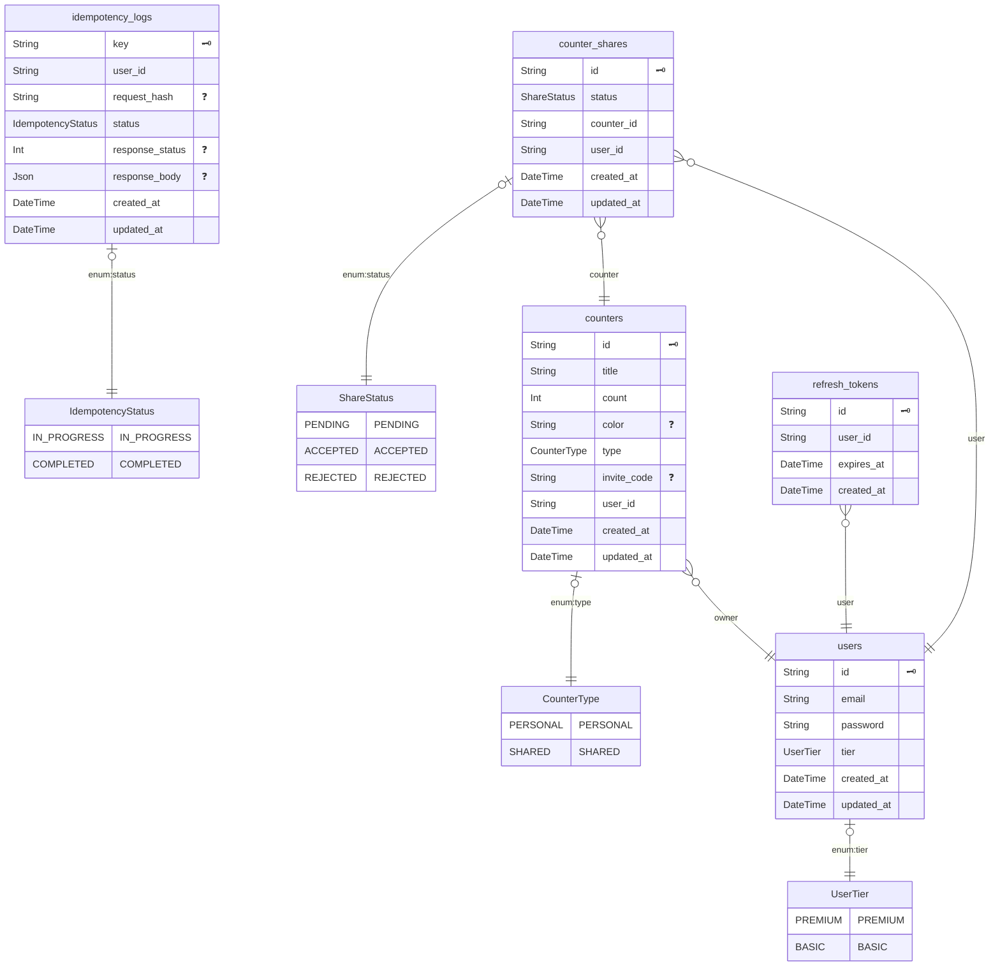

```mermaid
erDiagram

        CounterType {
            PERSONAL PERSONAL
SHARED SHARED
        }


        ShareStatus {
            PENDING PENDING
ACCEPTED ACCEPTED
REJECTED REJECTED
        }


        IdempotencyStatus {
            IN_PROGRESS IN_PROGRESS
COMPLETED COMPLETED
        }


        UserTier {
            PREMIUM PREMIUM
BASIC BASIC
        }

  "counters" {
    String id "🗝️"
    String title
    Int count
    String color "❓"
    CounterType type
    String invite_code "❓"
    String user_id
    DateTime created_at
    DateTime updated_at
    }


  "counter_shares" {
    String id "🗝️"
    ShareStatus status
    String counter_id
    String user_id
    DateTime created_at
    DateTime updated_at
    }


  "idempotency_logs" {
    String key "🗝️"
    String user_id
    String request_hash "❓"
    IdempotencyStatus status
    Int response_status "❓"
    Json response_body "❓"
    DateTime created_at
    DateTime updated_at
    }


  "refresh_tokens" {
    String id "🗝️"
    String user_id
    DateTime expires_at
    DateTime created_at
    }


  "users" {
    String id "🗝️"
    String email
    String password
    UserTier tier
    DateTime created_at
    DateTime updated_at
    }

    "counters" |o--|| "CounterType" : "enum:type"
    "counters" }o--|| users : "owner"
    "counter_shares" |o--|| "ShareStatus" : "enum:status"
    "counter_shares" }o--|| counters : "counter"
    "counter_shares" }o--|| users : "user"
    "idempotency_logs" |o--|| "IdempotencyStatus" : "enum:status"
    "refresh_tokens" }o--|| users : "user"
    "users" |o--|| "UserTier" : "enum:tier"
```
