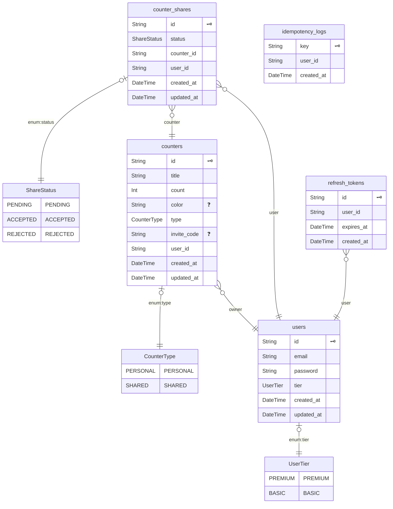

```mermaid
erDiagram

        CounterType {
            PERSONAL PERSONAL
SHARED SHARED
        }
    


        ShareStatus {
            PENDING PENDING
ACCEPTED ACCEPTED
REJECTED REJECTED
        }
    


        UserTier {
            PREMIUM PREMIUM
BASIC BASIC
        }
    
  "counters" {
    String id "🗝️"
    String title 
    Int count 
    String color "❓"
    CounterType type 
    String invite_code "❓"
    String user_id 
    DateTime created_at 
    DateTime updated_at 
    }
  

  "counter_shares" {
    String id "🗝️"
    ShareStatus status 
    String counter_id 
    String user_id 
    DateTime created_at 
    DateTime updated_at 
    }
  

  "idempotency_logs" {
    String key "🗝️"
    String user_id 
    DateTime created_at 
    }
  

  "refresh_tokens" {
    String id "🗝️"
    String user_id 
    DateTime expires_at 
    DateTime created_at 
    }
  

  "users" {
    String id "🗝️"
    String email 
    String password 
    UserTier tier 
    DateTime created_at 
    DateTime updated_at 
    }
  
    "counters" |o--|| "CounterType" : "enum:type"
    "counters" }o--|| users : "owner"
    "counter_shares" |o--|| "ShareStatus" : "enum:status"
    "counter_shares" }o--|| counters : "counter"
    "counter_shares" }o--|| users : "user"
    "refresh_tokens" }o--|| users : "user"
    "users" |o--|| "UserTier" : "enum:tier"
```
