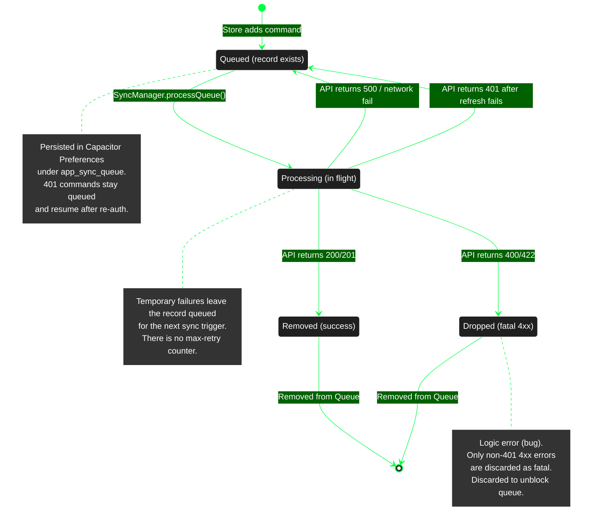

### Mutation Command Lifecycle

These are conceptual processing phases. `MutationCommand` records do not carry a status field; they are either present in the queue or removed from it.

```mermaid
%%{
  init: {
    'theme': 'base',
    'themeVariables': {
      'primaryColor': '#202020',
      'primaryTextColor': '#fff',
      'primaryBorderColor': '#ffffff',
      'lineColor': '#00ff41',
      'secondaryColor': '#006100',
      'tertiaryColor': '#fff',
      'noteBkgColor': '#333',
      'noteTextColor': '#fff',
      'noteBorderColor': '#fff'
    }
  }
}%%

stateDiagram-v2
    [*] --> Pending: Store adds command

    state "Queued (record exists)" as Pending
    state "Processing (in flight)" as Processing
    state "Removed (success)" as Completed
    state "Dropped (fatal 4xx)" as Dropped

    Pending --> Processing: SyncManager.processQueue()

    Processing --> Completed: API returns 200/201
    Processing --> Pending: API returns 500 / network fail
    Processing --> Pending: API returns 401 after refresh fails
    Processing --> Dropped: API returns 400/422

    Completed --> [*]: Removed from Queue
    Dropped --> [*]: Removed from Queue

    note right of Pending
        Persisted in Capacitor Preferences
        under app_sync_queue.
        401 commands stay queued
        and resume after re-auth.
    end note

    note right of Processing
        Temporary failures leave the record queued
        for the next sync trigger.
        There is no max-retry counter.
    end note

    note right of Dropped
        Logic error (bug).
        Only non-401 4xx errors
        are discarded as fatal.
        Discarded to unblock queue.
    end note
```
