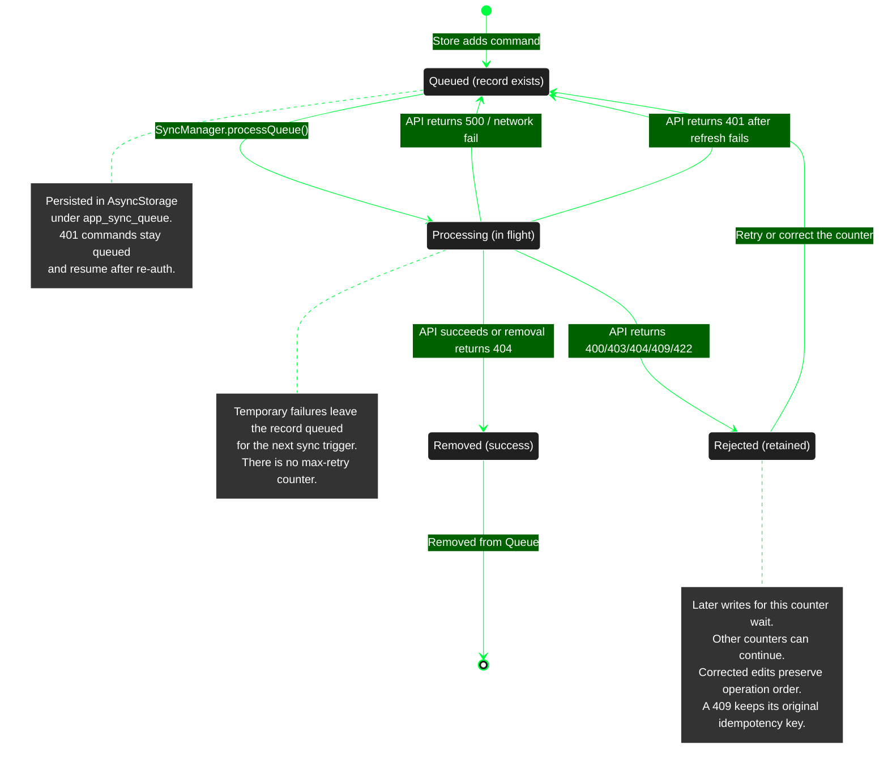

### Mutation Command Lifecycle

These are processing phases. Queued records can carry a `rejected` HTTP status. Rejected work stays on disk for recovery.

```mermaid
%%{
  init: {
    'theme': 'base',
    'themeVariables': {
      'primaryColor': '#202020',
      'primaryTextColor': '#fff',
      'primaryBorderColor': '#ffffff',
      'lineColor': '#00ff41',
      'secondaryColor': '#006100',
      'tertiaryColor': '#fff',
      'noteBkgColor': '#333',
      'noteTextColor': '#fff',
      'noteBorderColor': '#fff'
    }
  }
}%%

stateDiagram-v2
    [*] --> Pending: Store adds command

    state "Queued (record exists)" as Pending
    state "Processing (in flight)" as Processing
    state "Removed (success)" as Completed
    state "Rejected (retained)" as Rejected

    Pending --> Processing: SyncManager.processQueue()

    Processing --> Completed: API succeeds or removal returns 404
    Processing --> Pending: API returns 500 / network fail
    Processing --> Pending: API returns 401 after refresh fails
    Processing --> Rejected: API returns 400/403/404/409/422
    Rejected --> Pending: Retry or correct the counter

    Completed --> [*]: Removed from Queue

    note right of Pending
        Persisted in AsyncStorage
        under app_sync_queue.
        401 commands stay queued
        and resume after re-auth.
    end note

    note right of Processing
        Temporary failures leave the record queued
        for the next sync trigger.
        There is no max-retry counter.
    end note

    note right of Rejected
        Later writes for this counter wait.
        Other counters can continue.
        Corrected edits preserve operation order.
        A 409 keeps its original idempotency key.
    end note
```
