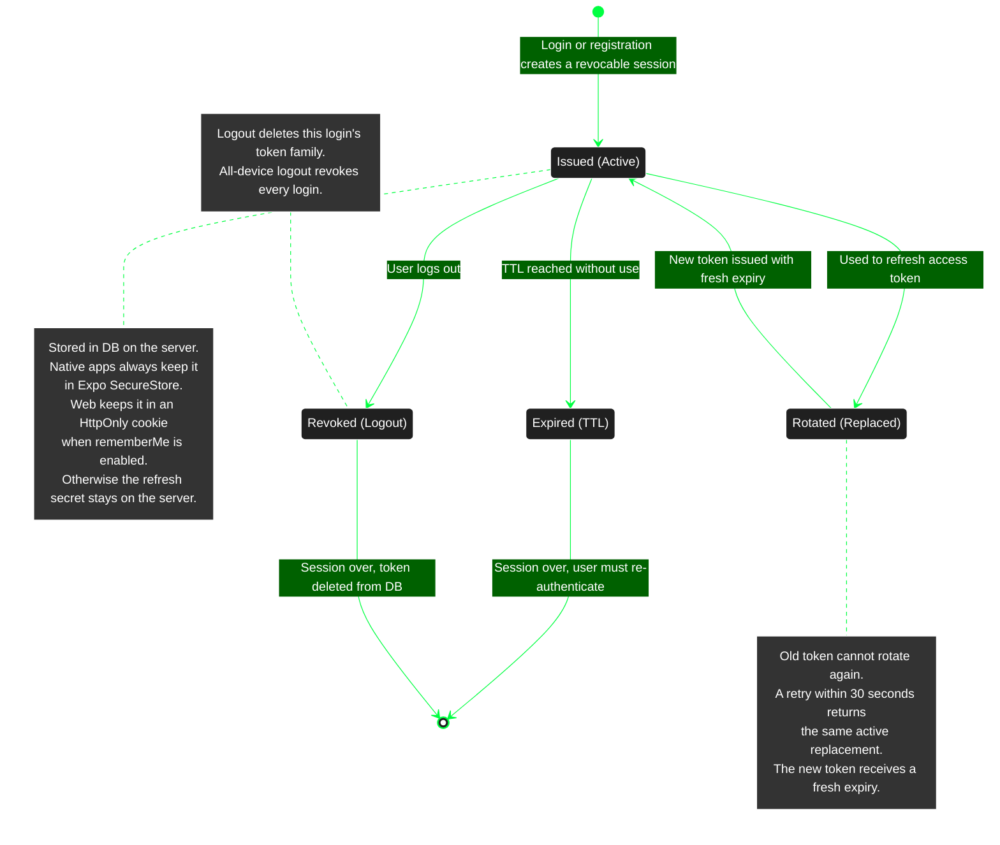

### Refresh Token Lifecycle

```mermaid
%%{
  init: {
    'theme': 'base',
    'themeVariables': {
      'primaryColor': '#202020',
      'primaryTextColor': '#fff',
      'primaryBorderColor': '#ffffff',
      'lineColor': '#00ff41',
      'secondaryColor': '#006100',
      'tertiaryColor': '#fff',
      'noteBkgColor': '#333',
      'noteTextColor': '#fff',
      'noteBorderColor': '#fff'
    }
  }
}%%

stateDiagram-v2
    [*] --> Issued: Login or registration creates a revocable session

    state "Issued (Active)" as Issued
    state "Rotated (Replaced)" as Rotated
    state "Expired (TTL)" as Expired
    state "Revoked (Logout)" as Revoked

    Issued --> Rotated: Used to refresh access token
    Rotated --> Issued: New token issued with fresh expiry

    Issued --> Expired: TTL reached without use
    Issued --> Revoked: User logs out

    Expired --> [*]: Session over, user must re-authenticate
    Revoked --> [*]: Session over, token deleted from DB

    note right of Issued
        Stored in DB on the server.
        Native apps always keep it
        in Expo SecureStore.
        Web keeps it in an HttpOnly cookie
        when rememberMe is enabled.
        Otherwise the refresh secret stays on the server.
    end note

    note right of Rotated
        Old token cannot rotate again.
        A retry within 30 seconds returns
        the same active replacement.
        The new token receives a fresh expiry.
    end note

    note left of Revoked
        Logout deletes this login's token family.
        All-device logout revokes every login.
    end note
```
