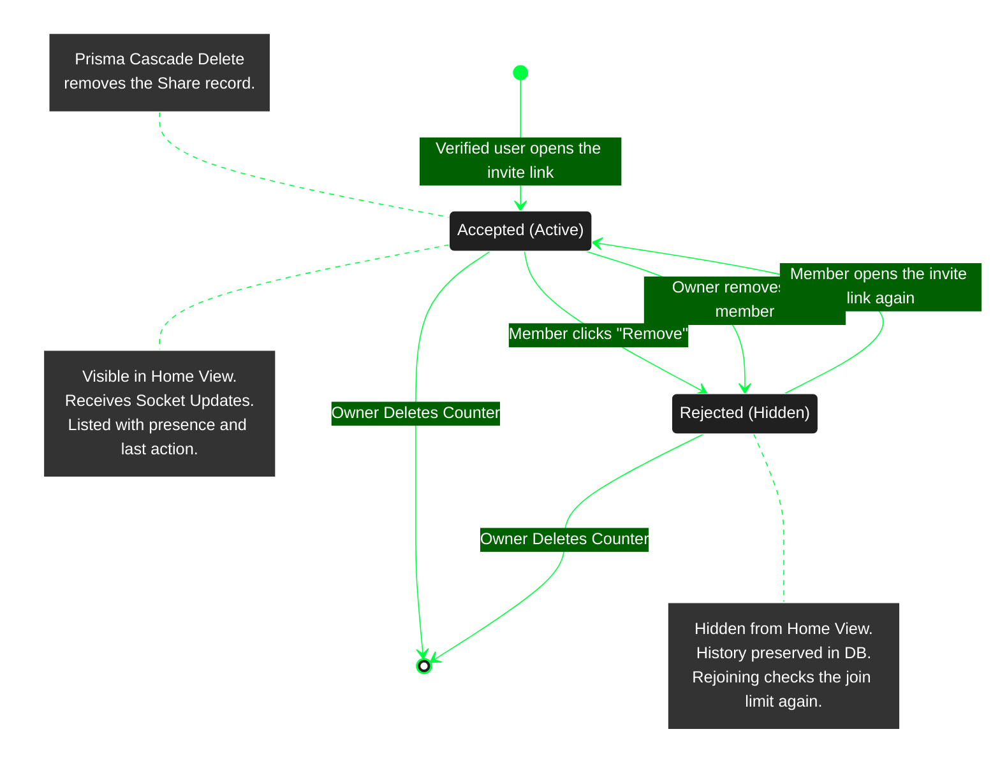

### Shared Counter Lifecycle

```mermaid
%%{
  init: {
    'theme': 'base',
    'themeVariables': {
      'primaryColor': '#202020',
      'primaryTextColor': '#fff',
      'primaryBorderColor': '#ffffff',
      'lineColor': '#00ff41',
      'secondaryColor': '#006100',
      'tertiaryColor': '#fff',
      'noteBkgColor': '#333',
      'noteTextColor': '#fff',
      'noteBorderColor': '#fff'
    }
  }
}%%

stateDiagram-v2
    [*] --> Accepted: Verified user opens the invite link

    state "Accepted (Active)" as Accepted
    state "Rejected (Hidden)" as Rejected

    Accepted --> Rejected: Member clicks "Remove"
    Accepted --> Rejected: Owner removes the member
    Rejected --> Accepted: Member opens the invite link again

    Accepted --> [*]: Owner Deletes Counter
    Rejected --> [*]: Owner Deletes Counter

    note right of Accepted
        Visible in Home View.
        Receives Socket Updates.
        Listed with presence and last action.
    end note

    note right of Rejected
        Hidden from Home View.
        History preserved in DB.
        Rejoining checks the join limit again.
    end note

    note left of Accepted
        Prisma Cascade Delete
        removes the Share record.
    end note
```
