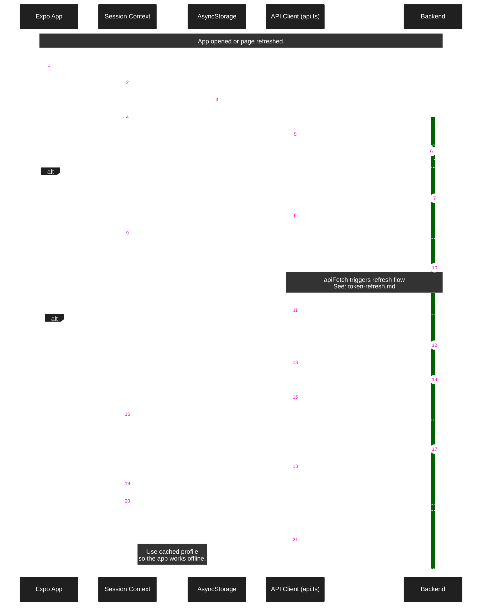

### Check Auth (Cold Start)

```mermaid
%%{
  init: {
    'theme': 'base',
    'themeVariables': {
      'primaryColor': '#202020',
      'primaryTextColor': '#fff',
      'primaryBorderColor': '#ffffff',
      'lineColor': '#00ff41',
      'secondaryColor': '#006100',
      'tertiaryColor': '#fff',
      'noteBkgColor': '#333',
      'noteTextColor': '#fff',
      'noteBorderColor': '#fff'
    }
  }
}%%

sequenceDiagram
    autonumber
    participant App as Expo App
    participant Session as Session Context
    participant Storage as AsyncStorage
    participant Client as API Client (api.ts)
    participant API as Backend

    Note over App, API: App opened or page refreshed.

    App->>Session: restoreSession()

    Session->>Storage: Get cached user profile
    Storage-->>Session: Cached user

    Session->>Client: GET /users/check-auth

    activate API
    Client->>API: Request (access token via cookie or header)
    API->>API: Validate access token

    alt Access Token Valid
        API-->>Client: 200 { user }
        Client-->>Session: User data
        Session->>Storage: Update cached profile

    else Access Token Expired
        API-->>Client: 401

        Note over Client, API: apiFetch triggers refresh flow<br/>See: token-refresh.md
        Client->>API: POST /users/refresh

        alt Refresh Succeeds
            API-->>Client: 200 (new tokens)
            Client->>API: Retry GET /users/check-auth
            API-->>Client: 200 { user }
            Client-->>Session: User data
            Session->>Storage: Update cached profile

        else Refresh Fails (expired / invalid)
            API-->>Client: 401
            Client-->>Session: Auth failed
            Session->>Storage: Clear local auth
            Session->>App: Redirect to /login
        end

    else Network Error
        Client-->>Session: Error
        Note right of Session: Use cached profile<br/>so the app works offline.
    end
    deactivate API
```
