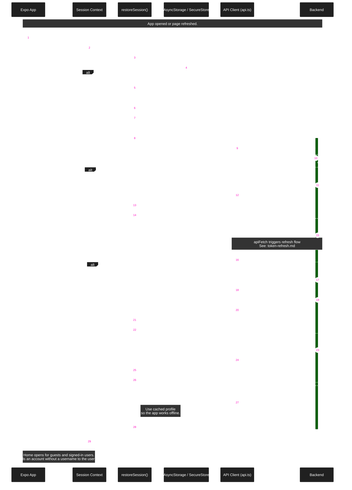

### Check Auth (Cold Start)

```mermaid
%%{
  init: {
    'theme': 'base',
    'themeVariables': {
      'primaryColor': '#202020',
      'primaryTextColor': '#fff',
      'primaryBorderColor': '#ffffff',
      'lineColor': '#00ff41',
      'secondaryColor': '#006100',
      'tertiaryColor': '#fff',
      'noteBkgColor': '#333',
      'noteTextColor': '#fff',
      'noteBorderColor': '#fff'
    }
  }
}%%

sequenceDiagram
    autonumber
    participant App as Expo App
    participant Session as Session Context
    participant Restore as restoreSession()
    participant Storage as AsyncStorage / SecureStore
    participant Client as API Client (api.ts)
    participant API as Backend

    Note over App, API: App opened or page refreshed.

    App->>Session: Mount the session provider
    Session->>Restore: restoreSession()
    Restore->>Storage: Get cached user profile
    Storage-->>Restore: Cached user or null

    alt No cached user
        Restore-->>Session: null (guest)
    else Native app without stored tokens
        Restore->>Storage: Clear local auth
        Restore-->>Session: null (guest)
    else Cached user with credentials
        Restore->>Client: GET /users/check-auth

        activate API
        Client->>API: Request (access token via cookie or header)
        API->>API: Validate access token

        alt Access Token Valid
            API-->>Client: 200 { user }
            Client-->>Restore: User data
            Restore->>Storage: Update cached profile
            Restore-->>Session: Verified user

        else Access Token Expired
            API-->>Client: 401

            Note over Client, API: apiFetch triggers refresh flow<br/>See: token-refresh.md
            Client->>API: POST /users/refresh

            alt Refresh Succeeds
                API-->>Client: 200 (new tokens)
                Client->>API: Retry GET /users/check-auth
                API-->>Client: 200 { user }
                Client-->>Restore: User data
                Restore->>Storage: Update cached profile
                Restore-->>Session: Verified user

            else Refresh Fails (expired / invalid)
                API-->>Client: 401
                Client-->>Restore: ApiError 401
                Restore->>Storage: Clear local auth
                Restore-->>Session: null (guest)
            end

        else Network Error
            Client-->>Restore: Error
            Note right of Restore: Use cached profile<br/>so the app works offline.
            Restore-->>Session: Cached user
        end
        deactivate API
    end

    Session->>Session: Set the user and mark the session ready
    Note over App, Session: Home opens for guests and signed-in users.<br/>Home sends an account without a username to the username step.
```
