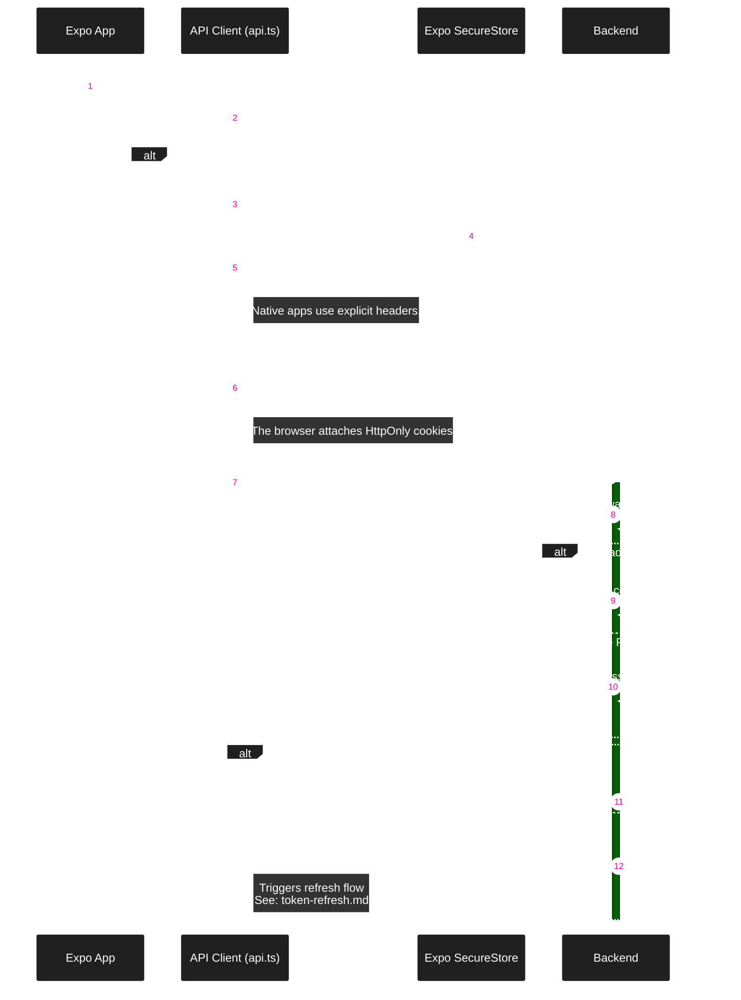

### Cross-Platform Auth Strategy

The account header is a consistency check, not an authentication credential.
Changing accounts aborts old requests and stops old queue work. Local writes finish before new-session writes begin.

Web login, refresh, logout, and account deletion share a Web Lock across tabs.
The lock covers each HTTP response, not refresh retries. This requires a secure browser context with Web Locks support.
Use HTTPS in production. Localhost also supports this check; plain HTTP on a LAN may not.

Logout requires confirmation and immediately closes the private UI. Queued changes keep their original account owner.
The server increments the account session version, removes its refresh tokens, and disconnects its old sockets.
This ends all account sessions. A failed remote logout does not block local sign-out; the client reports incomplete revocation.

Confirmed account deletion removes that account's local counters, pending commands, and saved order.
Cleanup waits for started writes and preserves another account's credentials. Failed server deletion leaves local work unchanged.

### Google sign-in

The client sends a Google ID token to `POST /users/google`. The API validates Google's signature, issuer, audience, and expiry.
Google's stable subject identifies the account. Email changes do not create a second account.
The API then issues the same Tally credentials as password login. Tally does not persist Google ID tokens.
The native Google SDK manages its own account cache.

An existing email account requires its Tally password before linking. A matching email alone never links accounts.
Google-only accounts have no password. Email recovery can set one through the existing code verification flow.
Gmail and Google Workspace addresses can satisfy email verification. Other addresses require Tally's email code.
Account deletion removes the Google identity and account data. It does not delete the user's Google account.

Configuration:

1. Set `GOOGLE_WEB_CLIENT_ID` on the API and `EXPO_PUBLIC_GOOGLE_WEB_CLIENT_ID` on the client to the same Web client ID.
2. Set `EXPO_PUBLIC_GOOGLE_IOS_CLIENT_ID` to the iOS client ID for `com.tallytracker.app`.
3. Add the web client's exact origins in Google Console, including each localhost port used for development. Paths are not origins.
4. Apply database migrations before starting the updated API. Restart Expo after changing environment values.
5. Rebuild the native app to include the Google SDK and iOS URL scheme. Expo Go cannot run this integration.
6. Before Android device testing, create an Android OAuth client with the app package and build certificate SHA-1.

GitHub Pages reads the repository variable `GOOGLE_WEB_CLIENT_ID` during its build. An unset value keeps Google login hidden.
The tracked Expo plugin forwards iOS Google callbacks before Expo's existing deep-link handlers.

This flow does not need the Web client secret or Google API access tokens. Never put a client secret in an Expo variable.
While the Google project is in Testing, use its listed test accounts. Apple sign-in remains separate release work.

References: [Expo Google authentication](https://docs.expo.dev/guides/google-authentication/),
[Google backend verification](https://developers.google.com/identity/sign-in/ios/backend-auth).
