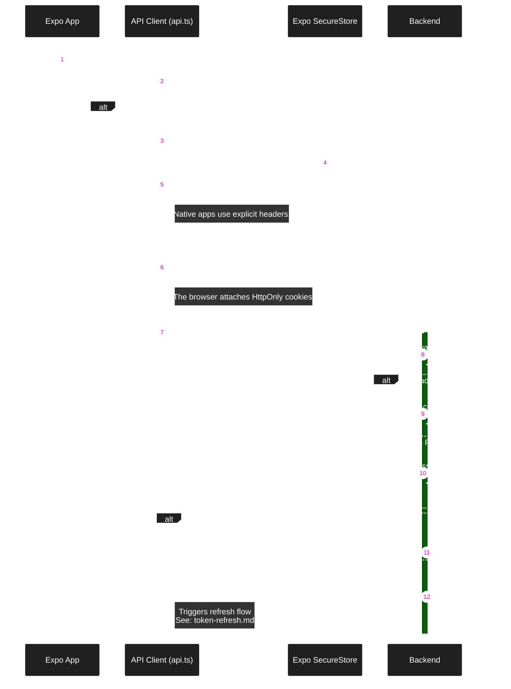

### Cross-Platform Auth Strategy

The account header is a consistency check, not an authentication credential.
Changing accounts aborts old requests and stops old queue work. Local writes finish before new-session writes begin.

Web login, refresh, and logout share a Web Lock across tabs. This requires a secure browser context with Web Locks support.
Use HTTPS in production. Localhost also supports this check; plain HTTP on a LAN may not.

Logout requires confirmation and immediately closes the private UI. Queued changes keep their original account owner.
The server increments the account session version, removes its refresh tokens, and disconnects its old sockets.
This ends all account sessions. A failed remote logout does not block local sign-out; the client reports incomplete revocation.
