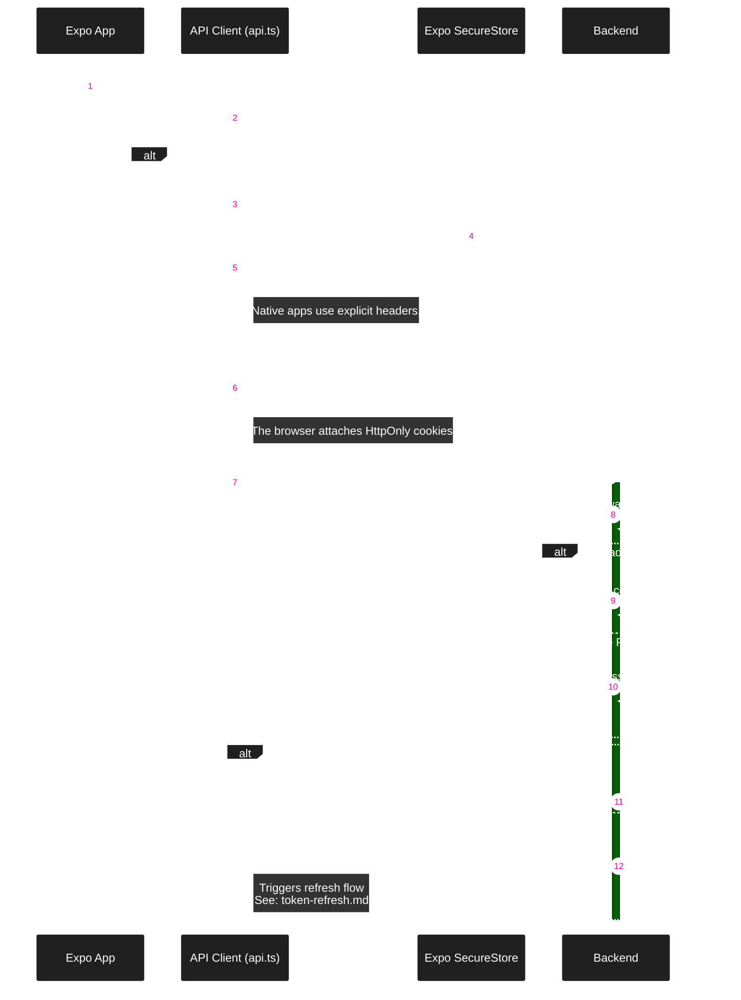

### Cross-Platform Auth Strategy

```mermaid
%%{
  init: {
    'theme': 'base',
    'themeVariables': {
      'primaryColor': '#202020',
      'primaryTextColor': '#fff',
      'primaryBorderColor': '#ffffff',
      'lineColor': '#00ff41',
      'secondaryColor': '#006100',
      'tertiaryColor': '#fff',
      'noteBkgColor': '#333',
      'noteTextColor': '#fff',
      'noteBorderColor': '#fff'
    }
  }
}%%

sequenceDiagram
    autonumber
    participant App as Expo App
    participant Client as API Client (api.ts)
    participant Storage as Expo SecureStore
    participant API as Backend

    App->>Client: apiFetch('/resource')

    Client->>Client: Check Platform.OS

    alt isNative is TRUE (iOS/Android)
        Client->>Storage: Get 'access_token'
        Storage-->>Client: Returns "ey..."
        Client->>Client: Add Header: "Authorization: Bearer ey..."
        Note right of Client: Native apps use explicit headers.
    else isNative is FALSE (Web)
        Client->>Client: Do NOT add Header
        Note right of Client: The browser attaches HttpOnly cookies.
    end

    Client->>API: Send Request

    activate API
    API->>API: Middleware Check

    alt Header Present?
        API->>API: Validate Access Token
    else Cookie Present?
        API->>API: Validate Access Token Cookie
    end

    alt Token Valid
        API-->>Client: 200 OK
    else Token Expired
        API-->>Client: 401 Unauthorized
        Note right of Client: Triggers refresh flow<br/>See: token-refresh.md
    end
    deactivate API
```
