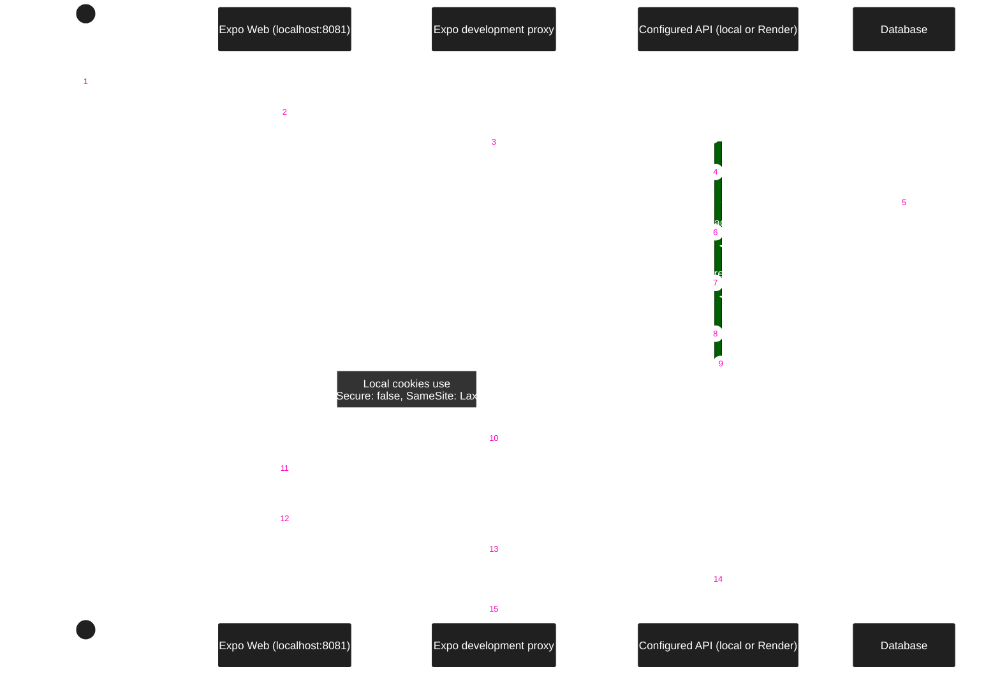

### Development Web Auth Flow

Expo proxies web development API requests to `EXPO_PUBLIC_API_URL` (default: `http://localhost:3000`).
The target can be the local API or Render. Restart Expo after changing this value.

The browser uses same-origin requests. The proxy removes the upstream cookie domain and `Secure` attribute,
and sets `SameSite=Lax` for local HTTP development. It preserves `HttpOnly`, expiry, and separate cookie headers.
Production API cookie settings do not change.

Socket.IO uses HTTP polling through this proxy during web development. Native and production clients keep their existing transports
and call the configured API directly. This proxy does not exist in the static web export.

