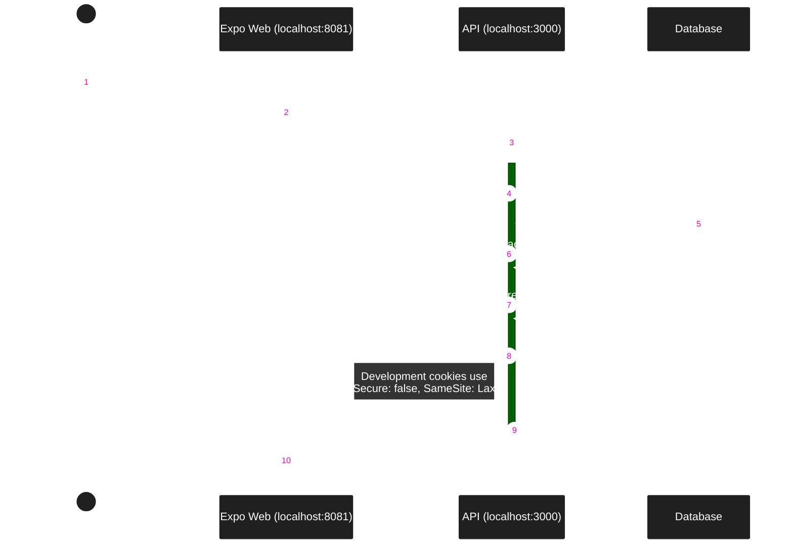

### Development Web Auth Flow

```mermaid
%%{
  init: {
    'theme': 'base',
    'themeVariables': {
      'primaryColor': '#202020',
      'primaryTextColor': '#fff',
      'primaryBorderColor': '#ffffff',
      'lineColor': '#00ff41',
      'secondaryColor': '#006100',
      'tertiaryColor': '#fff',
      'noteBkgColor': '#333',
      'noteTextColor': '#fff',
      'noteBorderColor': '#fff'
    }
  }
}%%

sequenceDiagram
    autonumber
    actor User
    participant Browser as Expo Web (localhost:8081)
    participant API as API (localhost:3000)
    participant DB as Database

    User->>Browser: Click "Login" (remember me ON)

    Browser->>API: POST /users/login with credentials
    API->>API: Allow localhost:8081 through CORS

    activate API
    API->>DB: Find User & Validate Password
    DB-->>API: User Data

    API->>API: Generate access token
    API->>API: Generate refresh token
    API->>DB: Store refresh token record

    Note left of API: Development cookies use<br/>Secure: false, SameSite: Lax
    API-->>Browser: 200 OK + Set-Cookie (access + refresh)
    deactivate API

    Browser->>Browser: Both Cookies Saved Successfully
```
