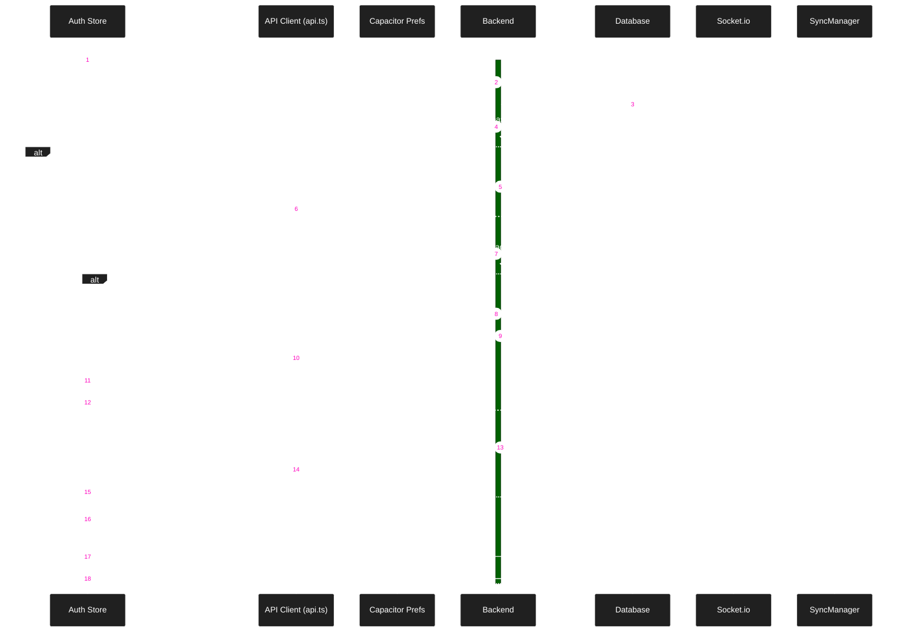

### Login Flow

```mermaid
%%{
  init: {
    'theme': 'base',
    'themeVariables': {
      'primaryColor': '#202020',
      'primaryTextColor': '#fff',
      'primaryBorderColor': '#ffffff',
      'lineColor': '#00ff41',
      'secondaryColor': '#006100',
      'tertiaryColor': '#fff',
      'noteBkgColor': '#333',
      'noteTextColor': '#fff',
      'noteBorderColor': '#fff'
    }
  }
}%%

sequenceDiagram
    autonumber
    participant Store as Auth Store
    participant Client as API Client (api.ts)
    participant Storage as Capacitor Prefs
    participant API as Backend
    participant DB as Database
    participant Socket as Socket.io
    participant Sync as SyncManager

    Store->>Client: POST /users/login { email, password, rememberMe }

    activate API
    API->>DB: Find user by normalized email
    DB-->>API: User record
    API->>API: Compare password hash

    alt Invalid Credentials
        API-->>Client: 404 or 401
        Client-->>Store: ApiError
    else Valid Credentials
        API->>API: Generate access token

        alt rememberMe true or native login
            API->>DB: Store refresh token record
            API-->>Client: 200 { user, accessToken, refreshToken } + Set-Cookie
            Client-->>Store: Auth response
            Store->>Storage: Cache user profile
            Store->>Storage: Store native tokens when present
        else rememberMe false on web
            API-->>Client: 200 { user, accessToken } + Set-Cookie(access)
            Client-->>Store: Auth response
            Store->>Storage: Cache user profile
        end

        Store->>Store: localStorage.AUTHORIZED = true
        Store->>Socket: connectSocket()
        Store->>Sync: processQueue()
    end
    deactivate API
```
