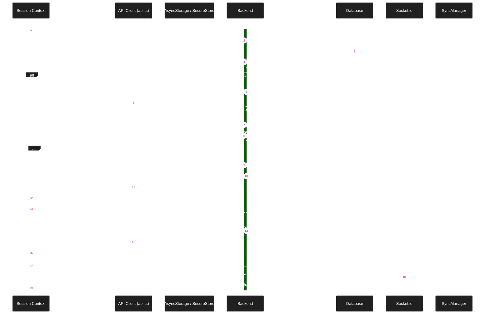

### Login Flow

```mermaid
%%{
  init: {
    'theme': 'base',
    'themeVariables': {
      'primaryColor': '#202020',
      'primaryTextColor': '#fff',
      'primaryBorderColor': '#ffffff',
      'lineColor': '#00ff41',
      'secondaryColor': '#006100',
      'tertiaryColor': '#fff',
      'noteBkgColor': '#333',
      'noteTextColor': '#fff',
      'noteBorderColor': '#fff'
    }
  }
}%%

sequenceDiagram
    autonumber
    participant Store as Session Context
    participant Client as API Client (api.ts)
    participant Storage as AsyncStorage / SecureStore
    participant API as Backend
    participant DB as Database
    participant Socket as Socket.io
    participant Sync as SyncManager

    Store->>Client: POST /users/login { email, password, rememberMe }

    activate API
    API->>DB: Find user by normalized email
    DB-->>API: User record
    API->>API: Compare password hash

    alt Invalid Credentials
        API-->>Client: 404 or 401
        Client-->>Store: ApiError
    else Valid Credentials
        API->>DB: Lock user and recheck password hash and session version
        API->>API: Generate access token

        alt rememberMe true or native login
            API->>DB: Store refresh token record
            API-->>Client: 200 { user, accessToken, refreshToken } + Set-Cookie
            Client-->>Store: Auth response
            Store->>Storage: Store native tokens when present
            Store->>Storage: Cache user profile after token writes finish
        else rememberMe false on web
            API-->>Client: 200 { user, accessToken } + Set-Cookie(access), clear old refresh cookie
            Client-->>Store: Auth response
            Store->>Storage: Cache user profile
        end

        Store->>Socket: connectSocket()
        Socket-->>Store: session-ready after authenticated room admission
        Store->>Sync: processQueue()
    end
    deactivate API
```
