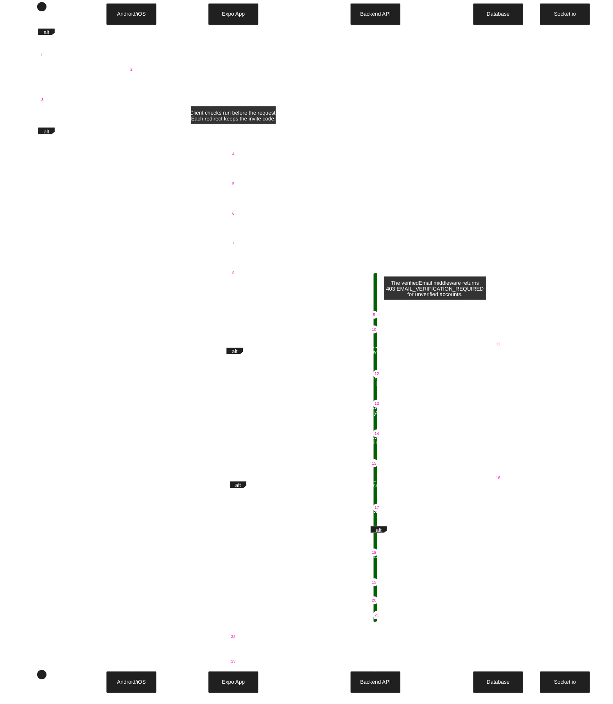

### Join Shared Counter

```mermaid
%%{
  init: {
    'theme': 'base',
    'themeVariables': {
      'primaryColor': '#202020',
      'primaryTextColor': '#fff',
      'primaryBorderColor': '#ffffff',
      'lineColor': '#00ff41',
      'secondaryColor': '#006100',
      'tertiaryColor': '#fff',
      'noteBkgColor': '#333',
      'noteTextColor': '#fff',
      'noteBorderColor': '#fff'
    }
  }
}%%

sequenceDiagram
    autonumber
    actor User
    participant OS as Android/iOS
    participant App as Expo App
    participant API as Backend API
    participant DB as Database
    participant Socket as Socket.io

    alt Entry Point A: Deep Link
        User->>OS: Click "tally://join?code=XYZ"
        OS->>App: Expo Router opens /join?code=XYZ
    else Entry Point B: Web / Manual
        User->>App: Visit "/join?code=XYZ"
    end

    Note over App: Client checks run before the request.<br/>Each redirect keeps the invite code.

    alt Signed in without a username
        App-->>User: Open the username step
    else Missing code
        App-->>User: Show "Invalid link" and open Home
    else Guest
        App-->>User: Open Login
    else Email not verified
        App-->>User: Open Verify Email
    else Ready to join
        App->>API: POST /counters/join { inviteCode } + idempotency key

        activate API
        Note right of API: The verifiedEmail middleware returns<br/>403 EMAIL_VERIFICATION_REQUIRED<br/>for unverified accounts.
        API->>DB: Lock the user row
        API->>DB: Find Counter by Code
        DB-->>API: Counter and shares, or null

        alt Invalid code or personal counter
            API-->>App: 404 Not Found
        else User owns counter
            API-->>App: 409 Conflict
        else Already ACCEPTED
            API-->>App: 200 OK (Already joined + Counter Data)
        else Not Joined or Previously Rejected
            API->>DB: Get User Tier
            DB-->>API: User Tier

            alt BASIC user already joined one shared counter
                API-->>App: 403 Forbidden
            else Join Allowed
                alt New Share
                    API->>DB: INSERT CounterShare (Status: ACCEPTED)
                else Re-Joining (Was Rejected)
                    API->>DB: UPDATE CounterShare (Status: ACCEPTED)
                end

                API->>Socket: Emit counters-changed to each participant
                API-->>App: 201 Created (+ Counter Data)
            end
        end
        deactivate API

        App->>App: Add a new counter to the store
        App-->>User: Show the result and open Home
    end
```
