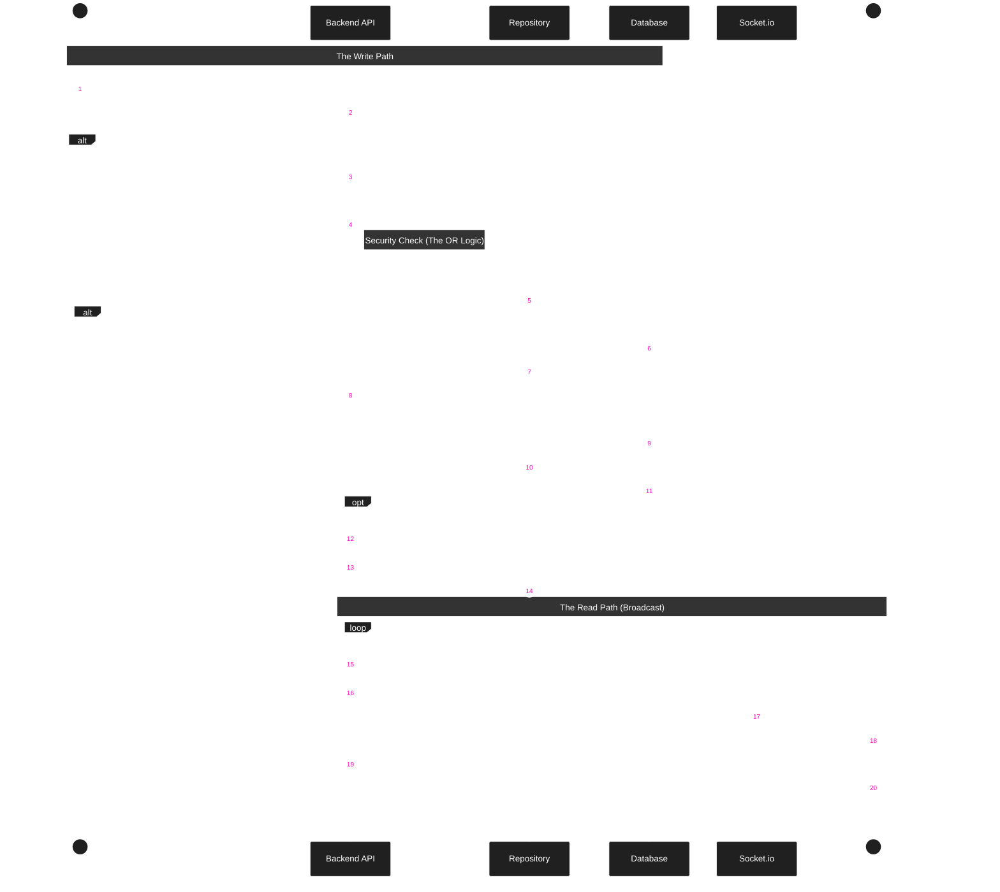

### Real-Time Shared Counter Increment

```mermaid
%%{
  init: {
    'theme': 'base',
    'themeVariables': {
      'primaryColor': '#202020',
      'primaryTextColor': '#fff',
      'primaryBorderColor': '#ffffff',
      'lineColor': '#00ff41',
      'secondaryColor': '#006100',
      'tertiaryColor': '#fff',
      'noteBkgColor': '#333',
      'noteTextColor': '#fff',
      'noteBorderColor': '#fff'
    }
  }
}%%

sequenceDiagram
    autonumber
    actor Writer as User A (Owner or Member)
    participant API as Backend API
    participant Repo as Repository
    participant DB as Database
    participant Socket as Socket.io
    actor Viewer as User B (Participant)

    Note over Writer, DB: The Write Path
    Writer->>API: PUT /counters/increment/:counterId { amount } + idempotency key

    API->>API: runIdempotentMutation()

    alt Replayed Idempotency Key
        API-->>Writer: Original status and body, without a second emit
    else Fresh Mutation
        API->>Repo: increment({ counterId, userId, amount })

        Note right of API: Security Check (The OR Logic)
        Repo->>DB: Find Counter where:<br/>1. User is Owner<br/>OR<br/>2. Share is ACCEPTED

        alt Permission Denied
            DB-->>Repo: Null
            Repo-->>API: Null
            API-->>Writer: 404 Not Found
        else Permission Granted
            DB-->>Repo: Counter Found
            Repo->>DB: Atomic increment
            DB-->>API: Updated Counter Data

            opt Shared counter and amount is not 0
                API->>DB: Upsert CounterActivity (latest change per member)
            end

            API->>Repo: getParticipants(counterId)
            Repo-->>API: Owner and accepted member IDs

            Note over API, Viewer: The Read Path (Broadcast)
            loop For Each Participant
                API->>Socket: io.to(UserID).emit('counter-update', counter)
            end
            API-->>Writer: 200 OK { counter }

            Socket-->>Viewer: Event: 'counter-update'
            Viewer->>API: GET /counters
            API-->>Viewer: Current counters
            Viewer->>Viewer: Merge the snapshot with pending local writes
        end
    end
```

Clients treat socket events as a signal to fetch a new snapshot. They do not apply the event payload directly.
